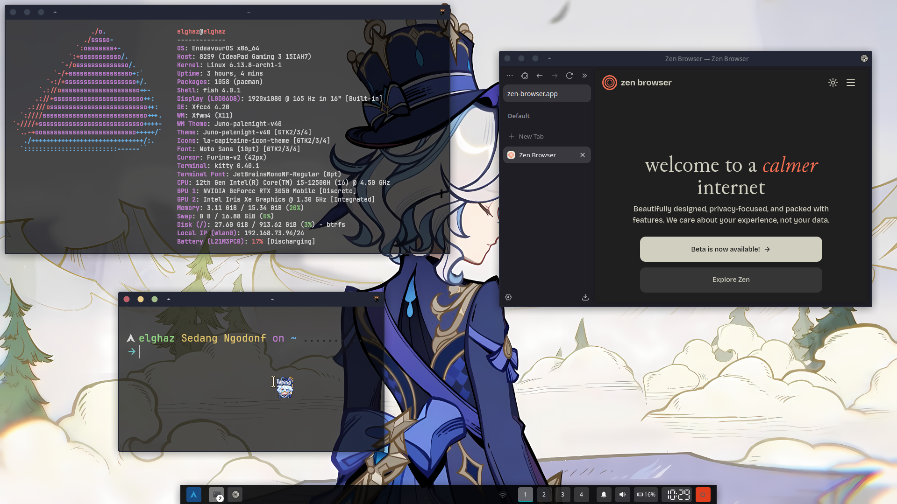

# ELghaz's Dotfiles

 

## Stuff stuffs

- OS: EndeavourOS
- DE: Xfce4 4.20
- Theme: [juno](/gtk-themes/.themes/Juno-palenight-v40)
- WM: Xfwm4
- Terminal Emulator: [kitty](kitty/.config/kitty)
- Shell: [fish](fish/.config/fish)

## Theme stuffs
- gtk-themes
- [gtk.css](gtk-3.0/.config/gtk-3.0/gtk.css) for panel
- Icon themes: [Zafiro icons](icons/.icons/zafiro-Icons-Dark)
- Cursor: [Furina-V2](icons/.icons/Furina-v2)
